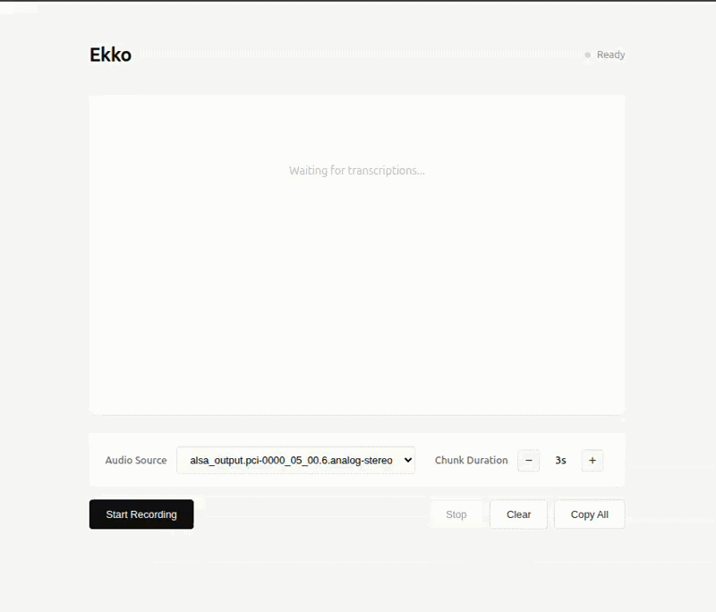

# Ekko


A near real-time desktop audio transcription tool with a clean terminal and web UI. Capture system audio, transcribe on the fly using local Whisper models or Google Gemini API

## Key features

- Local and cloud transcription backends: whisper (local) and gemini (Google API).
- Privacy-first local mode when using Whisper models; no network round trips.
- Clean UI for live transcription and simple controls.



## Quick Start


```sh
# Install make
sudo apt update
sudo apt install build-essential

# Build the go binding library
make build

# Run the app
make dev
```
### Prerequisites

Run the script below to install required dependencies

```bash
# Install required dependencies
make install

# or
./install.sh
```

This will install:

- `pulseaudio-utils` - For audio capture
- `ffmpeg` - For audio processing

