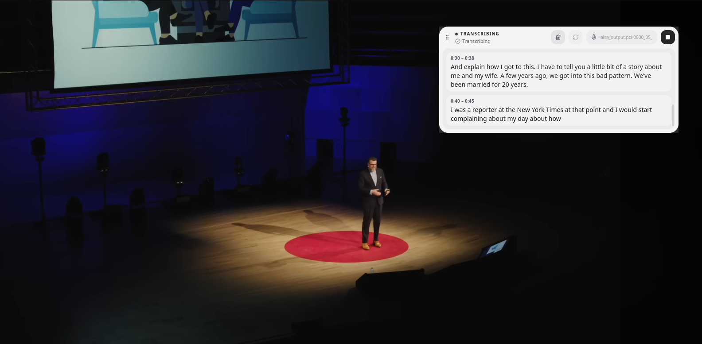

# Ekko


[](https://github.com/tuanta7/ekko/actions/workflows/ci.yml)

## Setup

Clone this repository with whisper-cpp submodule

```sh
git clone https://github.com/tuanta7/ekko.git
git submodule update --init --recursive
```

Download Whisper model before starting transcription.

```sh
# tiny.en-q5_1.bin
make download-model
```

Downloaded `.bin` files are ignored by Git.

## Development

Install app and audio dependencies, then build Whisper support:

```sh
make setup
```

Run the app in development mode:

```sh
make dev
```

For a production build:

```sh
make build
```


