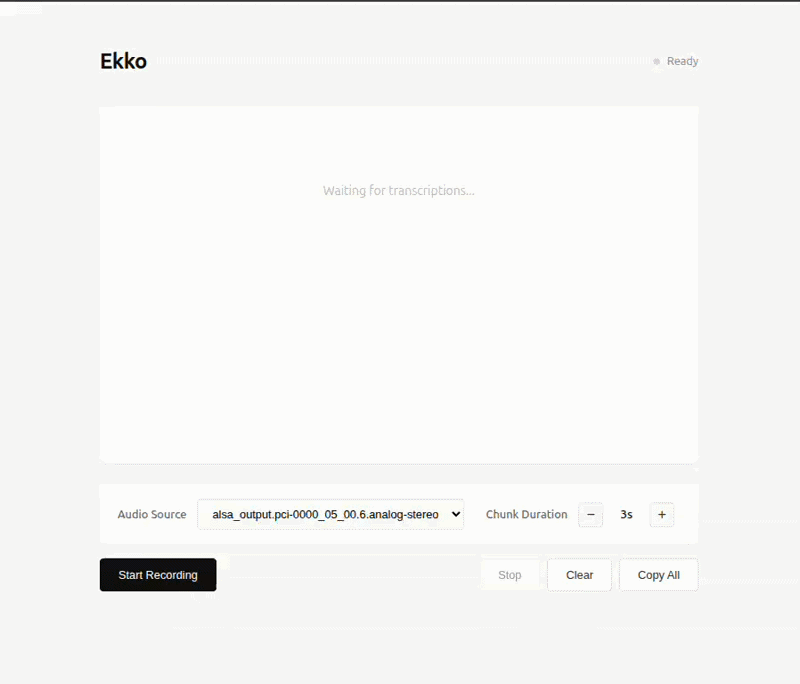

# Ekko


[](https://github.com/tuanta7/ekko/actions/workflows/ci.yml)

A near real-time desktop audio transcription tool with a clean terminal and web UI. Capture system audio, transcribe on the fly using local Whisper models or Google Gemini API.

## Key features

- Local and cloud transcription backends: Whisper (local) and Gemini (Google API).
- Privacy-first local mode when using Whisper models; no network round trips.
- Clean TUI for live transcription and simple controls.
- Optional web UI served over HTTP.



## Quick Start


Download a GGML Whisper model from [huggingface.co/ggerganov/whisper.cpp](https://huggingface.co/ggerganov/whisper.cpp/tree/main) and place it in `ggml/`.
See [`ggml/README.md`](ggml/README.md) for details.

```sh
# example — download the smallest English model (~150 MB)
wget -P ggml/ https://huggingface.co/ggerganov/whisper.cpp/resolve/main/ggml-base.bin
```

Then run the development server:

```sh
# TUI mode (default)
make dev                       # uses MODEL=ggml-base by default
make dev MODEL=ggml-small-q5_1 # override model

# Web mode (serves on :8080)
make dev-web
```

## CLI reference

```
USAGE:
   ekko run [OPTIONS]

OPTIONS:
   --web, -w               Enable web/server mode (default: false)
   --addr value, -a value  Address to listen on in web mode (default: ":8080")
   --model value, -m value Whisper GGML model name to use (default: "ggml-base")
   --help, -h              show help
```

## License

MIT 
